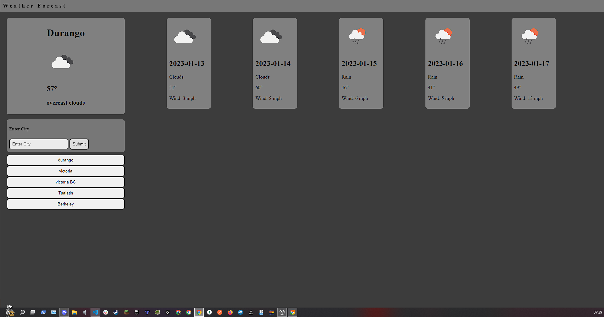

# Weather Forcase

Deployed on github pages, you can view it [here](https://ianssenne.github.io/ch-weather-app/)

## Objective

To create a site that allows you to view a forcast and keep a short history of queried cities

## Technologies Used

| name       | usage                                       |
| :--------- | :------------------------------------------ |
| javascript | used for implimentation of the page logic   |
| css        | used for styling the page                   |
| html       | used for defining the structure of the page |
| prettier   | used for formatting of files                |

## The Final Version of the Javascript Quiz Website

## features

- storing seen locations using `localStorage`
- view the current weather
- view the weather for the next 5 days
